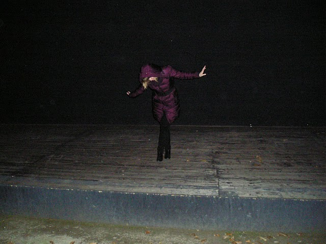

# 461von465

### „Auftakt“

und ich würd’ so gern viel lieber von dir träumen.
mir wünschen, dass die Tür sich öffnet
und du da stehst.
mich nimmst.
mich mitnimmst.
und ganz langsam tanzen wir
im Sonnenstrahl, der durch das Fenster fällt.
ganz still, ganz warm, ganz leise.
und mit uns tanzen die Staubfunken.
nur hier. nur jetzt. nur wir.
 
 
 
 
### Paradies

In einem Paradies wohnte ich.
Da gab es einen sichelförmigen Mond.
Und keinen Tag und keine Nacht.
Es wimmelte von Menschen, die das taten,
was ihre Berufung war.

Da gab es Männer,
die einem den Kopf verdrehten.
So schien es zumindest für sie.
Da gab es die Freude,
den Männern den Kopf zu verdrehen.

Die Freude...
Die sich auftuende Erfüllung
bei der Feststellung, dass
es sich eigentlich gar nicht
um die anderen drehte, sondern um einen selbst.
 
 
 
 
### Zugestellt

Und dann ist es auf einmal still.
Kein Geräusch lenkt die Aufmerksamkeit.
Und dann kommt die Sehnsucht.
Die Sehnsucht nach dem, was auf der anderen Seite ist.
Das andere Ich, das man schon immer kannte. Aber sich damit eingerichtet hatte,
es zur Abholung bereit gestellt bekommen zu haben. Und dann holt man es nie ab. Oder doch?
Man lässt es im Raum der Möglichkeiten, schaut es sich gern an, ohne es auszupacken.
Man weiß, wenn man es öffnet, dann kann und will man es nicht mehr zurückstellen.
Es ist dann da. Unerbittlich. Ehrlich. Kompromisslos.
 
 
 
 
### Der Moment in dem...

... ich Berlin verliere.
Ich sehe es kommen, als wäre es gestern gewesen.
Ich sehe meine erste große Stadt.

In naiver Voraussicht nannte ich Berlin einst meine erste große Liebe.
Die erste Liebe ist bekanntlich zu Verlust und Nimmerwiederkehr bestimmt.
Die große Liebe ist polyamourös und hedonistisch.

Berlin liebt dich. Berlin liebt mich nicht.
Es machte mich süchtig. Die liebesadrenalinausschenkende Wirtin und ihre dürstende Parasitin.

Berlin war noch nie wählerisch. Man nimmt, was man kriegen kann.
Buben mit bayerischem Becken und Rehkitze mit spätzlefarbenem Haar.
Hauptsache sexy.

Und während ich durch die Straßen lauf’, wird langsam bunt zur grauen Farce.
Ich seh’ keinen Mythos mehr, nichts ist authentisch, nur ab und zu vertraute Arroganz.
Alles ist mehr angepasst als kreativ.

Und das ist der Moment, in dem ich Berlin verloren ging.
 
 
 
       
### Sonnensystem

Und nun lebe ich am Ende der Welt meiner Kindheit.
Ich sehe Menschen mit Koffern. Ich sehe Menschen mit Kindern.
Hände mit Stadtplänen.
Agglomeration.

Und nun lebe ich am Ende der Welt meiner Kindheit.
Wir umkreisen uns und sind uns fremd.
Das Zentrum ist irgendwo dazwischen.
Als wären wir zwei gleichpolige Magneten.

Alles lädt sich auf. Die Stadt, ich, die Menschen.
Blitze wie Feuerwerk und bunte Lichter wie ein Wetterleuchten.
Die Legende der Nacht ist bereits geschrieben.

Ladungen bereit zum Tanz. Langsam und lustvoll.
Im Jetzt und Hier, in diesem Moment.
In diesem Moment am Ende der Welt meiner Kindheit.
